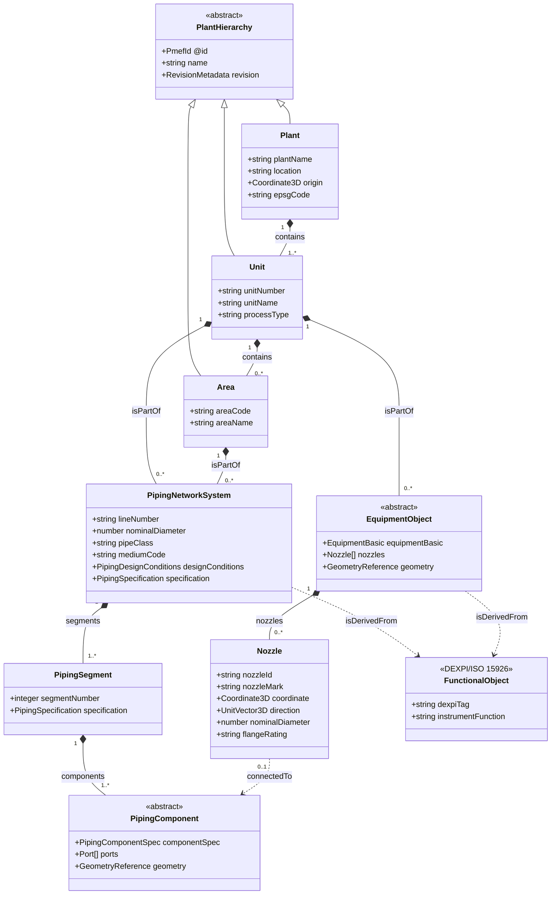
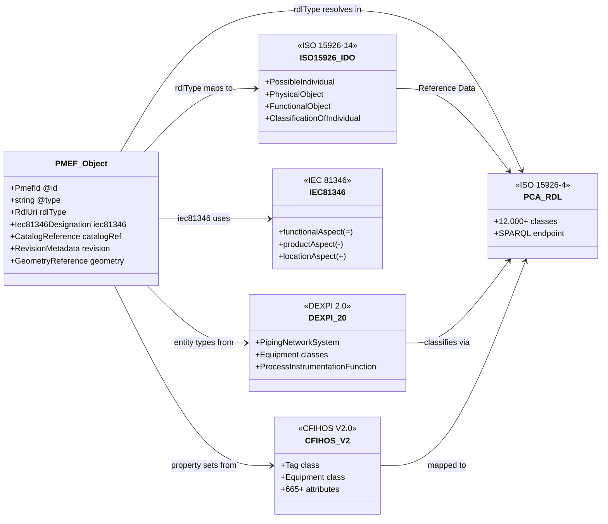

# PMEF Data Model — Domain Overview

Rendered with [Mermaid](https://mermaid.js.org). Open on [mermaid.live](https://mermaid.live) to view interactively.

---

## Top-Level Domain Diagram

---

## Standards Mapping Overview

