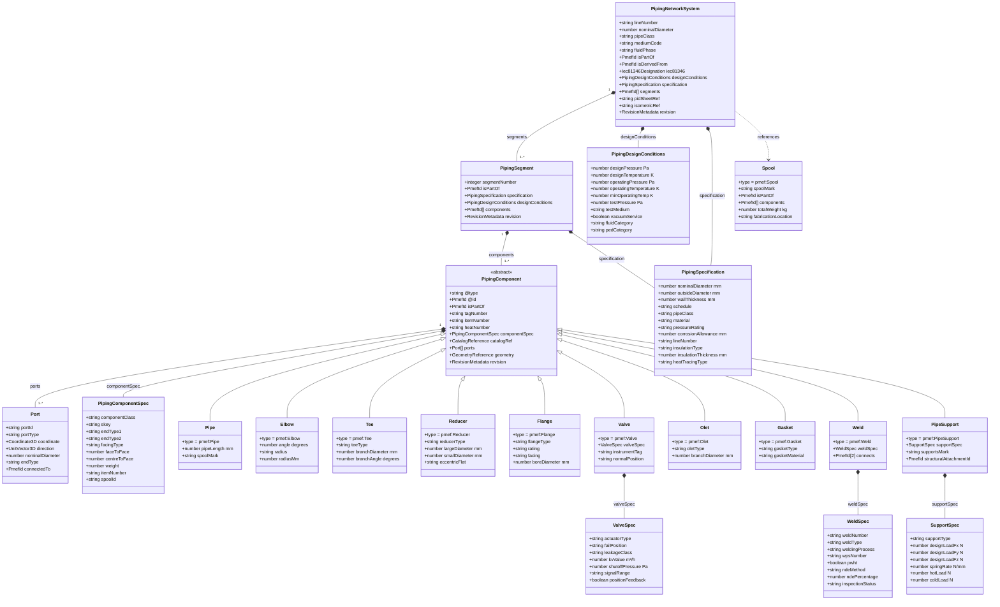
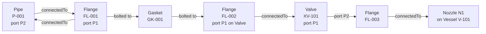

# PMEF Piping Domain — Detailed Class Diagram

---

## PCF → PMEF Field Mapping

| PCF Record/Field | PMEF Field | Notes |
|-----------------|-----------|-------|
| `PIPELINE-REFERENCE` | `PipingNetworkSystem.lineNumber` | Full line number tag |
| `PIPELINE-REF SPOOL-ID` | `PipingNetworkSystem.segments[].spoolId` | Segment-level |
| Component type keyword (e.g. `ELBOW`) | `PipingComponent.componentSpec.componentClass` | Normalised PMEF enum |
| `SKEY` | `PipingComponent.componentSpec.skey` | Extended 8-char in PMEF |
| `END-POINT X Y Z BORE` | `PipingComponent.ports[].coordinate` + `.nominalDiameter` | mm in PMEF (PCF may be inch) |
| `MATERIAL-IDENTIFIER` | `PipingComponent.catalogRef.catalogId` | Normalised via catalog |
| `ATTRIBUTE0..99` | `PipingComponent.customAttributes{}` | Typed in PMEF |
| `TEMPERATURE` | `PipingNetworkSystem.designConditions.operatingTemperature` | K in PMEF |
| `MAX-TEMPERATURE` | `PipingNetworkSystem.designConditions.designTemperature` | K |
| `MAX-PRESSURE` | `PipingNetworkSystem.designConditions.designPressure` | Pa in PMEF |

---

## Port Connectivity Model

Ports resolve to a topology graph: `PipingComponent.ports[].connectedTo` → `Port.@id` on the adjacent component.
This graph is the PMEF equivalent of PCF coordinate-based connectivity.
