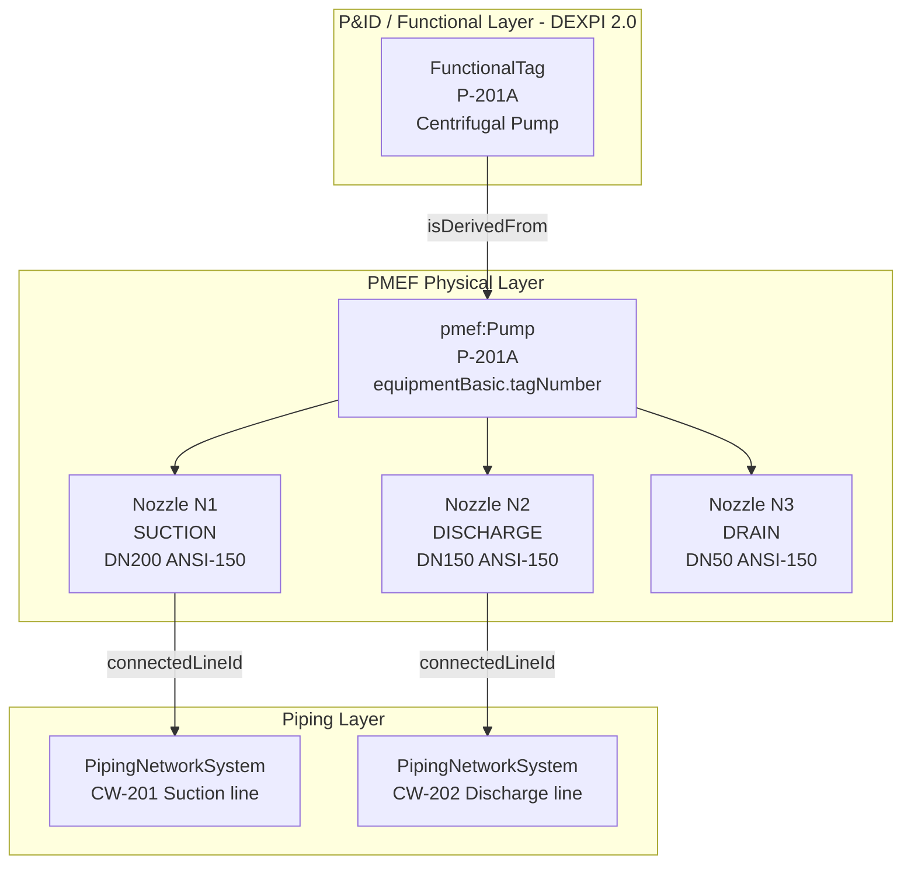

# PMEF Equipment Domain — Detailed Class Diagram

```mermaid
classDiagram
    direction TB

    class EquipmentObject {
        <<abstract>>
        +string @type
        +PmefId @id
        +string pmefVersion
        +PmefId isPartOf
        +PmefId isDerivedFrom
        +EquipmentBasic equipmentBasic
        +Iec81346Designation iec81346
        +RdlUri rdlType
        +CatalogReference catalogRef
        +Nozzle[] nozzles
        +GeometryReference geometry
        +DocumentLink[] documents
        +RevisionMetadata revision
    }

    class EquipmentBasic {
        +string tagNumber
        +string equipmentClass
        +string serviceDescription
        +string designCode
        +string manufacturer
        +string model
        +string serialNumber
        +string unitArea
        +string trainId
        +boolean nsss
    }

    class Nozzle {
        +string nozzleId
        +string nozzleMark
        +string service
        +number nominalDiameter mm
        +string flangeRating
        +string facingType
        +Coordinate3D coordinate
        +UnitVector3D direction
        +number elevation mm
        +PmefId connectedLineId
        +string connectedPortId
    }

    class Vessel {
        +type = pmef:Vessel
        +string vesselSubtype
        +VesselDesign vesselDesign
    }

    class VesselDesign {
        +number designPressureInternal Pa
        +number designTemperatureMax K
        +number designTemperatureMin K
        +number volume m³
        +string shellMaterial
        +number shellInsideDiameter mm
        +number tangentToTangent mm
        +string headType
        +string orientation
        +boolean fireproofingRequired
    }

    class Tank {
        +type = pmef:Tank
        +string tankType
        +string apiStandard
        +number capacity m³
        +number workingCapacity m³
        +number diameter mm
        +string contents
        +boolean heatingCoil
        +boolean mixerInstalled
    }

    class Pump {
        +type = pmef:Pump
        +PumpSpec pumpSpec
        +string motorId
    }

    class PumpSpec {
        +string pumpType
        +string apiStandard
        +number designFlow m³/h
        +number designHead m
        +number npshRequired m
        +number motorPower kW
        +string sealType
        +string drivetype
        +boolean sparePump
    }

    class Compressor {
        +type = pmef:Compressor
        +CompressorSpec compressorSpec
        +string motorId
    }

    class CompressorSpec {
        +string compressorType
        +string apiStandard
        +number designInletFlow m³/h
        +number pressureRatio
        +number shaftPower kW
        +string driverType
        +string sealType
    }

    class HeatExchanger {
        +type = pmef:HeatExchanger
        +HeatExchangerSpec hxSpec
    }

    class HeatExchangerSpec {
        +string hxType
        +string tema
        +string dutyType
        +number heatDuty W
        +number heatTransferArea m²
        +string shellSideMedium
        +string tubeSideMedium
        +number overallHeatTransferCoeff W/m²K
        +integer numberOfTubes
    }

    class Column {
        +type = pmef:Column
        +string columnType
        +VesselDesign vesselDesign
        +integer numberOfTrays
        +string trayType
        +number operatingPressure Pa
        +number topTemperature K
        +number bottomTemperature K
    }

    class Reactor {
        +type = pmef:Reactor
        +string reactorType
        +VesselDesign vesselDesign
        +string catalystType
        +string heatRemovalType
        +number installedPower kW
        +number powerSupplyVoltage V
    }

    class Filter {
        +type = pmef:Filter
        +string filterType
        +number filtrationRating µm
        +number designFlow m³/h
        +string cleaningType
    }

    class Turbine {
        +type = pmef:Turbine
        +string turbineType
        +number inletPressure Pa
        +number outletPressure Pa
        +number shaftPower kW
    }

    class GenericEquipment {
        +type = pmef:GenericEquipment
        +string genericEquipmentSubtype
    }

    EquipmentObject *-- EquipmentBasic : equipmentBasic
    EquipmentObject *-- "0..*" Nozzle : nozzles

    EquipmentObject <|-- Vessel
    EquipmentObject <|-- Tank
    EquipmentObject <|-- Pump
    EquipmentObject <|-- Compressor
    EquipmentObject <|-- HeatExchanger
    EquipmentObject <|-- Column
    EquipmentObject <|-- Reactor
    EquipmentObject <|-- Filter
    EquipmentObject <|-- Turbine
    EquipmentObject <|-- GenericEquipment

    Vessel *-- VesselDesign
    Column *-- VesselDesign
    Reactor *-- VesselDesign
    Pump *-- PumpSpec
    Compressor *-- CompressorSpec
    HeatExchanger *-- HeatExchangerSpec
```

---

## Equipment ↔ Piping Connection Model

---

## CFIHOS → PMEF Equipment Class Mapping (excerpt)

| CFIHOS Equipment Class | PMEF `@type` | Key `rdlType` |
|-----------------------|--------------|----------------|
| `CENTRIFUGAL_PUMP` | `pmef:Pump` | `http://data.posccaesar.org/rdl/RDS354645` |
| `RECIPROCATING_PUMP` | `pmef:Pump` | `http://data.posccaesar.org/rdl/RDS354653` |
| `CENTRIFUGAL_COMPRESSOR` | `pmef:Compressor` | `http://data.posccaesar.org/rdl/RDS354661` |
| `SHELL_AND_TUBE_HEAT_EXCHANGER` | `pmef:HeatExchanger` | `http://data.posccaesar.org/rdl/RDS327274` |
| `PRESSURE_VESSEL` | `pmef:Vessel` | `http://data.posccaesar.org/rdl/RDS327255` |
| `STORAGE_TANK` | `pmef:Tank` | `http://data.posccaesar.org/rdl/RDS327248` |
| `DISTILLATION_COLUMN` | `pmef:Column` | `http://data.posccaesar.org/rdl/RDS327282` |
| `FIXED_BED_REACTOR` | `pmef:Reactor` | `http://data.posccaesar.org/rdl/RDS327291` |
| `ELECTRIC_ARC_FURNACE` | `pmef:Reactor` (subtype EAF) | Project-level catalog URI |
| `BASKET_STRAINER` | `pmef:Filter` | `http://data.posccaesar.org/rdl/RDS354760` |
| `STEAM_TURBINE` | `pmef:Turbine` | `http://data.posccaesar.org/rdl/RDS354775` |
