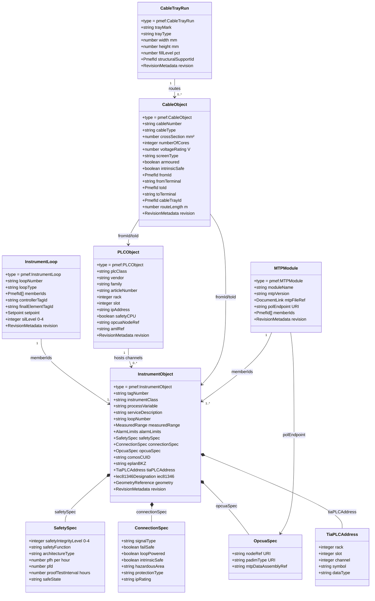

# PMEF E&I Domain — Detailed Class Diagram

---

## Standards Alignment

| PMEF Field | Upstream Standard |
|-----------|------------------|
| `tagNumber` | ISA 5.1, IEC 62424 |
| `instrumentClass` | DEXPI 2.0 instrument types |
| `safetySpec.safetyIntegrityLevel` | IEC 61508, IEC 61511 |
| `safetySpec.architectureType` | IEC 61508-6 Annex B |
| `connectionSpec.signalType` | IEC 61158 (fieldbus standards) |
| `connectionSpec.protectionType` | IEC 60079 (ATEX/IECEx) |
| `opcuaSpec.nodeRef` | OPC UA Part 6 (URI addressing) |
| `opcuaSpec.padimType` | PA-DIM (OPC 30500) DeviceType |
| `tiaPLCAddress` | TIA Portal Openness API |
| `comosCUID` | COMOS platform UID |
| `eplanBKZ` | EPLAN IEC 81346 BKZ |
| `MTPModule.polEndpoint` | MTP 2.0 (VDI/VDE/NAMUR 2658) |
| `MTPModule.mtpFileRef` | AML/AASX (IEC 62424) |

---

## Signal Type → Physical Interface Mapping

| `signalType` | Cable type | Typical loop | Protocol |
|-------------|-----------|-------------|---------|
| `4_20MA` | Instrumentation pair, shielded | AI/AO channel | Analog |
| `HART` | Same as 4-20mA | AI channel + HART modem | Digital overlay |
| `PROFIBUS_PA` | Special PA cable (blue) | DP/PA coupler | IEC 61158-2 |
| `FOUNDATION_FIELDBUS` | FF cable (orange) | FF segment | IEC 61158 |
| `PROFINET` | CAT5e/6 or fiber | Profinet switch | IEEE 802.3 |
| `DISCRETE_24VDC` | Control cable | DI/DO channel | — |

---

## COMOS ↔ PMEF Round-Trip Key

| COMOS attribute | PMEF field |
|----------------|-----------|
| `CUID` | `InstrumentObject.comosCUID` |
| `Tag` | `InstrumentObject.tagNumber` |
| `BKZ (IEC 81346)` | `InstrumentObject.iec81346.functionalAspect` |
| `SIL Level` | `InstrumentObject.safetySpec.safetyIntegrityLevel` |
| `AML InternalElement ID` | `PLCObject.amlRef` |
| `MTP file reference` | `MTPModule.mtpFileRef` |
