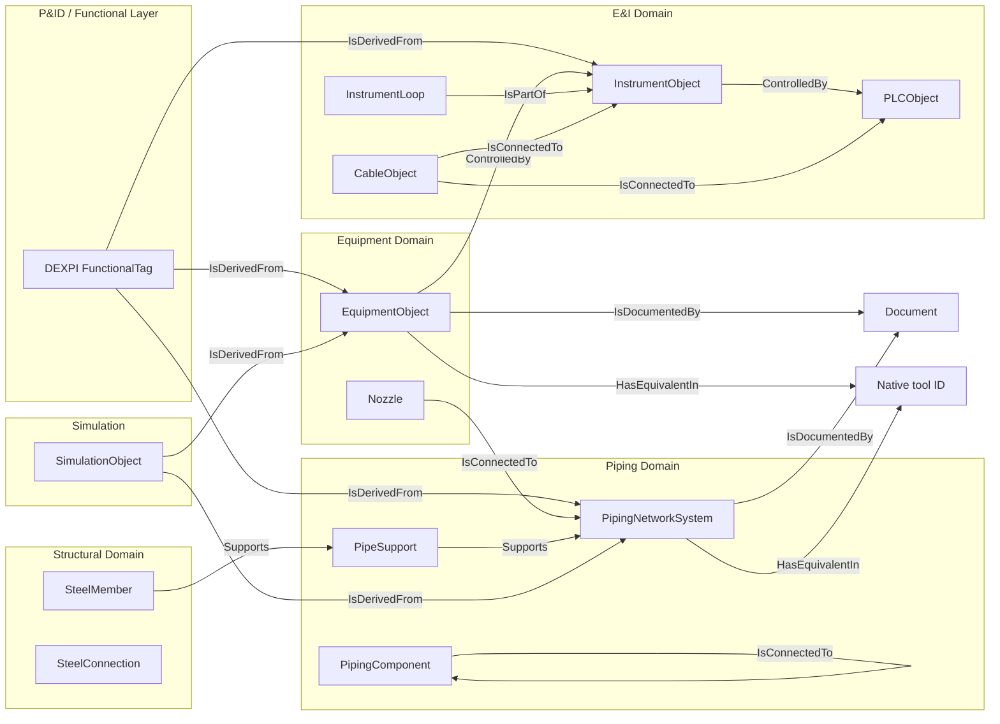

# PMEF Typed Relationships

## Relationship Type Hierarchy

```mermaid
classDiagram
    direction TB

    class BaseRelationship {
        <<abstract>>
        +string @type
        +PmefId @id
        +string relationType
        +PmefId sourceId
        +PmefId targetId
        +string sourceType
        +string targetType
        +string derivedBy
        +number confidence 0-1
        +string notes
        +RevisionMetadata revision
    }

    class IsPartOf {
        +relationType = IS_PART_OF
    }

    class IsConnectedTo {
        +relationType = IS_CONNECTED_TO
        +string connectionMedium
        +string connectionPointSource
        +string connectionPointTarget
    }

    class IsDerivedFrom {
        +relationType = IS_DERIVED_FROM
        +string sourceStandard
        +string mappingVersion
    }

    class Supports {
        +relationType = SUPPORTS
        +LoadTransferred loadTransferred
    }

    class ControlledBy {
        +relationType = CONTROLLED_BY
        +string controlMode
        +string signalPath
    }

    class IsDocumentedBy {
        +relationType = IS_DOCUMENTED_BY
        +string documentType
        +string documentId
        +string documentUri
        +string documentRevision
    }

    class IsRevisionOf {
        +relationType = IS_REVISION_OF
        +string changeReason
        +string changeType
    }

    class HasEquivalentIn {
        +relationType = HAS_EQUIVALENT_IN
        +string targetSystem
        +string targetSystemId
        +string mappingType
    }

    class IsCollocatedWith {
        +relationType = IS_COLLOCATED_WITH
    }

    class ReplacedBy {
        +relationType = REPLACED_BY
        +string replacementDate
        +string workOrderRef
    }

    BaseRelationship <|-- IsPartOf
    BaseRelationship <|-- IsConnectedTo
    BaseRelationship <|-- IsDerivedFrom
    BaseRelationship <|-- Supports
    BaseRelationship <|-- ControlledBy
    BaseRelationship <|-- IsDocumentedBy
    BaseRelationship <|-- IsRevisionOf
    BaseRelationship <|-- HasEquivalentIn
    BaseRelationship <|-- IsCollocatedWith
    BaseRelationship <|-- ReplacedBy
```



---

## Cross-Domain Relationship Map



---

## Relationship Quick Reference

| Type | Direction | Typical use |
|------|-----------|-------------|
| `IsPartOf` | child → parent | Unit/Area hierarchy, cross-file |
| `IsConnectedTo` | bidirectional | Nozzle↔Piping, Cable↔Instrument |
| `IsDerivedFrom` | physical → functional | 3D tag ← P&ID/DEXPI tag |
| `Supports` | structure → piping | Steel beam → pipe support → pipe |
| `ControlledBy` | equipment → instrument | Valve ← FIC controller |
| `IsDocumentedBy` | object → document | Equipment ← datasheet |
| `IsRevisionOf` | new → old | Revised pipe → previous revision |
| `HasEquivalentIn` | PMEF → native | PMEF pump → E3D object ID |
| `IsCollocatedWith` | bidirectional | Co-mounted instruments |
| `ReplacedBy` | old → new | Failed pump → replacement pump |

---

## NDJSON Example

```jsonc
// IsDerivedFrom: physical pump P-201A derived from DEXPI functional tag
{"@type":"pmef:IsDerivedFrom","@id":"urn:pmef:rel:eaf-2026:P-201A-derived","relationType":"IS_DERIVED_FROM","sourceId":"urn:pmef:obj:eaf-2026:P-201A","targetId":"urn:pmef:functional:eaf-2026:P-201A-func","sourceStandard":"DEXPI_2.0","derivedBy":"ADAPTER_IMPORT","confidence":1.0,"revision":{"revisionId":"r2026-03-31-001","changeState":"SHARED"}}

// ControlledBy: valve XV-101 controlled by instrument FIC-101
{"@type":"pmef:ControlledBy","@id":"urn:pmef:rel:eaf-2026:XV-101-ctrl","relationType":"CONTROLLED_BY","sourceId":"urn:pmef:obj:eaf-2026:XV-10101","targetId":"urn:pmef:obj:eaf-2026:FIC-10101","controlMode":"PID","signalPath":"FIC-10101 output → XV-10101 positioner (4-20mA)","revision":{"revisionId":"r2026-03-31-001","changeState":"SHARED"}}

// Supports: steel beam B101 supports pipe support S1 on CW-201
{"@type":"pmef:Supports","@id":"urn:pmef:rel:eaf-2026:B101-sup-S1","relationType":"SUPPORTS","sourceId":"urn:pmef:obj:eaf-2026:STEEL-B101","targetId":"urn:pmef:obj:eaf-2026:CW-201-SUP-001","loadTransferred":{"Fy":-4200.0},"revision":{"revisionId":"r2026-03-31-001","changeState":"SHARED"}}

// HasEquivalentIn: pump P-201A in PMEF = object 12345 in AVEVA E3D
{"@type":"pmef:HasEquivalentIn","@id":"urn:pmef:rel:eaf-2026:P-201A-e3d","relationType":"HAS_EQUIVALENT_IN","sourceId":"urn:pmef:obj:eaf-2026:P-201A","targetId":"urn:pmef:obj:eaf-2026:P-201A","targetSystem":"AVEVA_E3D","targetSystemId":"DB:EAF_2026:EQUIP:12345","mappingType":"EXACT","derivedBy":"ADAPTER_IMPORT","confidence":1.0,"revision":{"revisionId":"r2026-03-31-001","changeState":"SHARED"}}
```
