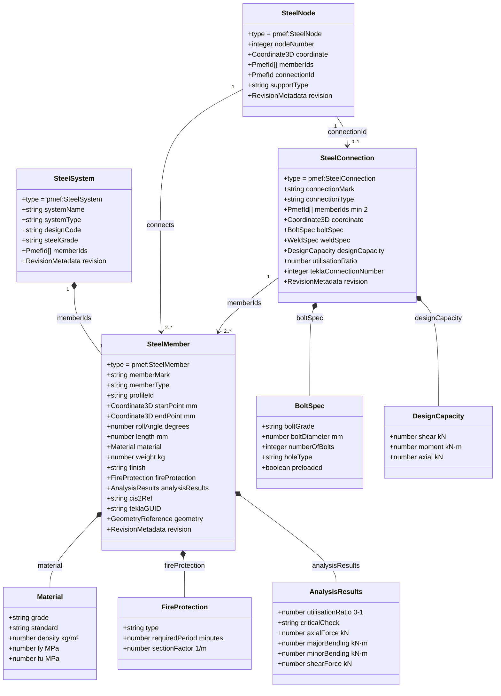

# PMEF Structural Steel Domain — Class Diagram

---

## Profile ID Convention

PMEF profile IDs use the format `<standard>:<designation>`:

| Standard | Examples |
|----------|---------|
| `EN` | `EN:HEA200`, `EN:IPE300`, `EN:UPE200`, `EN:RHS200x100x6`, `EN:CHS219.1x8` |
| `AISC` | `AISC:W12x53`, `AISC:HSS6x4x0.25`, `AISC:L4x4x0.5` |
| `FLAT` | `FLAT:200x20` (flat bar, width×thickness) |
| `ROUND` | `ROUND:50` (solid rod, diameter) |
| `CUSTOM` | `CUSTOM:<project-code>` (project-specific profiles) |

---

## CIS/2 → PMEF Mapping

| CIS/2 entity | PMEF type | Notes |
|-------------|-----------|-------|
| `StructuralMember` | `pmef:SteelMember` | 1:1 |
| `Connection` | `pmef:SteelConnection` | 1:1 |
| `Node` | `pmef:SteelNode` | 1:1 |
| `Structure` | `pmef:SteelSystem` | 1:1 |
| `Material` | `SteelMember.material` | embedded |
| `CrossSection` | `SteelMember.profileId` | PMEF catalog ref |
| `EndRelease` | `SteelConnection.connectionType` | PINNED / MOMENT_RIGID |
| `BoundaryCondition` | `SteelNode.supportType` | FIXED / PINNED / ROLLER_* |

---

## Tekla Structures ↔ PMEF Round-Trip

| Tekla attribute | PMEF field |
|----------------|-----------|
| `GUID` | `SteelMember.teklaGUID` |
| `Name` (mark) | `SteelMember.memberMark` |
| `Profile` | `SteelMember.profileId` |
| `Material.Grade` | `SteelMember.material.grade` |
| `StartPoint` | `SteelMember.startPoint` |
| `EndPoint` | `SteelMember.endPoint` |
| `ConnectionNumber` | `SteelConnection.teklaConnectionNumber` |
| `PartNumber` | `SteelMember.memberMark` |
