# PMEF Geometry Layer — Parametric Primitives

## Primitive Hierarchy

```mermaid
classDiagram
    direction TB

    class ParametricGeometryObject {
        +type = pmef:ParametricGeometry
        +PmefId @id
        +PmefId ownerRef
        +string lod
        +AnyPrimitive primitive
    }

    class AnyPrimitive {
        <<oneOf>>
    }

    class Cylinder {
        +type = CYLINDER
        +Coordinate3D center
        +UnitVector3D axis
        +number radius mm
        +number innerRadius mm
        +number length mm
    }

    class Cone {
        +type = CONE
        +Coordinate3D center
        +UnitVector3D axis
        +number r1 mm
        +number r2 mm
        +number length mm
        +number innerR1 mm
        +number innerR2 mm
    }

    class Sphere {
        +type = SPHERE
        +Coordinate3D center
        +number radius mm
    }

    class Dish {
        +type = DISH
        +Coordinate3D center
        +UnitVector3D axis
        +number shellRadius mm
        +string dishType
        +number depth mm
    }

    class CircTorus {
        +type = CIRC_TORUS
        +Coordinate3D center
        +UnitVector3D axis
        +UnitVector3D startDir
        +number torusRadius mm
        +number tubeRadius mm
        +number angleDeg degrees
    }

    class Snout {
        +type = SNOUT
        +Coordinate3D center
        +UnitVector3D axis
        +number r1 mm
        +number r2 mm
        +number length mm
        +number offsetX mm
        +number offsetY mm
    }

    class Box {
        +type = BOX
        +Coordinate3D center
        +number xLen mm
        +number yLen mm
        +number zLen mm
        +number rotationZ degrees
    }

    class Extrusion {
        +type = EXTRUSION
        +Coordinate3D startPt
        +Coordinate3D endPt
        +string profileId
        +number rollDeg degrees
    }

    class Revolution {
        +type = REVOLUTION
        +Coordinate3D axisPoint
        +UnitVector3D axis
        +number[][] profile2d
        +number angleDeg
    }

    class ValvePrimitive {
        +type = VALVE_BODY
        +string valveBodyType
        +Coordinate3D center
        +UnitVector3D direction
        +number boreD mm
        +number faceToFace mm
        +number actuatorHeight mm
    }

    class NozzlePrimitive {
        +type = NOZZLE
        +Coordinate3D origin
        +UnitVector3D axis
        +number nomDN mm
        +number projection mm
        +number flangeOD mm
    }

    class SteelProfilePrimitive {
        +type = STEEL_PROFILE
        +Coordinate3D startPt
        +Coordinate3D endPt
        +string profileId
        +number rollDeg
    }

    class CableTrayPrimitive {
        +type = CABLE_TRAY
        +Coordinate3D[] centerline
        +number width mm
        +number height mm
        +string trayType
    }

    class MeshRef {
        +type = MESH_REF
        +string meshUri
        +string meshFormat
        +integer featureId
    }

    class Composite {
        +type = COMPOSITE
        +children[]
    }

    ParametricGeometryObject *-- AnyPrimitive : primitive

    AnyPrimitive <|-- Cylinder
    AnyPrimitive <|-- Cone
    AnyPrimitive <|-- Sphere
    AnyPrimitive <|-- Dish
    AnyPrimitive <|-- CircTorus
    AnyPrimitive <|-- Snout
    AnyPrimitive <|-- Box
    AnyPrimitive <|-- Extrusion
    AnyPrimitive <|-- Revolution
    AnyPrimitive <|-- ValvePrimitive
    AnyPrimitive <|-- NozzlePrimitive
    AnyPrimitive <|-- SteelProfilePrimitive
    AnyPrimitive <|-- CableTrayPrimitive
    AnyPrimitive <|-- MeshRef
    AnyPrimitive <|-- Composite
```



---

## Primitive ↔ Component Mapping

| PMEF Component | Primary Primitive | Notes |
|---------------|------------------|-------|
| `pmef:Pipe` | `CYLINDER` (hollow) | `innerRadius` = bore/2 |
| `pmef:Elbow` | `CIRC_TORUS` | `angleDeg`=90 for standard 90° elbow |
| `pmef:Reducer` (concentric) | `CONE` (hollow) | r1=large DN/2, r2=small DN/2 |
| `pmef:Reducer` (eccentric) | `SNOUT` | offsetX/Y for flat orientation |
| `pmef:Flange` | `REVOLUTION` | Profile = flange cross-section |
| `pmef:Valve` | `VALVE_BODY` | Simplified bounding shape |
| `pmef:Tee` | `COMPOSITE` | Run cylinder + branch cylinder + fillet |
| `pmef:PipeSupport` (resting) | `BOX` | Shoe/cradle bounding box |
| `pmef:PipeSupport` (hanger) | `CYLINDER` (rod) | Simple rod representation |
| `pmef:Vessel` (shell) | `COMPOSITE` | Shell `CYLINDER` + head `DISH` × 2 |
| `pmef:Tank` (vertical) | `COMPOSITE` | Shell + roof `CONE`/`DISH` |
| `pmef:Pump` | `COMPOSITE` + `MESH_REF` | Bounding box + vendor mesh LOD3 |
| `pmef:HeatExchanger` | `COMPOSITE` | Shell `CYLINDER` + channels `BOX` |
| `Nozzle` | `NOZZLE` | Composite: barrel `CYLINDER` + `REVOLUTION` flange |
| Steel member | `STEEL_PROFILE` or `EXTRUSION` | Profile from catalog |
| Cable tray | `CABLE_TRAY` | Routed centerline with w×h section |

---

## LOD Definitions

| LOD Code | Geometry Detail | Typical Use |
|----------|----------------|-------------|
| `BBOX_ONLY` | Axis-aligned bounding box | Space reservation, early design |
| `LOD1_COARSE` | Simple cylinder/box per object | Spatial clash check level 1 |
| `LOD2_MEDIUM` | Full primitive assembly | Standard plant model, issue IFC |
| `LOD3_FINE` | All flanges, nozzle details, supports | Piping stress / construction model |
| `LOD4_FABRICATION` | Weld preps, bevel angles, dimensions | Shop drawing, spool fabrication |

---

## Coordinate System Convention

```text
Z (Up / Elevation)
│
│
│    Y (North)
│   /
│  /
│ /
└────────── X (East)

Right-handed system.
Units: millimetres (mm).
Angles: degrees (°).
Z-up convention consistent with AVEVA E3D, CADMATIC, AutoCAD Plant 3D.
glTF export: rotate +90° around X axis (Y-up → Z-up conversion).
```
